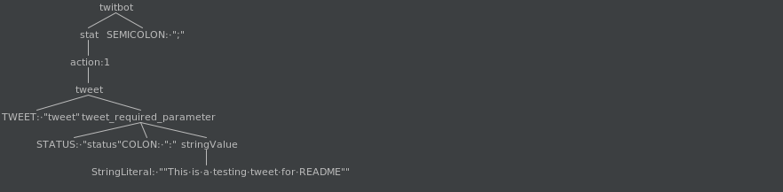
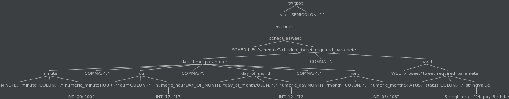

# Final Year Project
A domain specific language designed to operate and automate Twitter accounts/bots using Tweepy API.
## Setting up the virtual-env
- Install Python 3
```bash
cd web-application/dsl_bots/
. ./activate
```
## Generating ANTLR files
```bash
cd web-application/dsl_bots/core/dsl/antlr4/
module load ./antlr4module
antlr4py3 -visitor dsl.g4
antlr4py3 dslLexerGrammar.g4
antrl4py3 NumericLexer.g4
```
## Running Domain Specific Language token example
```bash
cd web-application/dsl_bots/core/dsl/dsl_source_files/
echo tweet status : "Testing tokens" \; > input.txt
pygrun dsl twitbot --tokens input.txt
[@0,0:4='tweet',<9>,1:0]
[@1,6:11='status',<11>,1:6]
[@2,13:13=':',<28>,1:13]
[@3,15:33='Pygrun Token Test',<3>,1:15]
[@4,35:35=';',<27>,1:35]
[@5,37:36='<EOF>',<-1>,2:0]

pygrun dsl twitbot --tree input.txt
(twitbot 
   (stat 
      (action 
         (tweet tweet 
            (tweet_required_parameter status : 
               (stringValue Pygrun Token Test))))) ;)
```
## Running management commands to execute the domain specific language
### Create superuser and runserver
- Create a superuser to login to Django admin.
- Change username and password
```
python manage.py createsuperuser
Username: admin
Email address: 
Password: admin
Passowrd (again): admin
Superuser created successfully.
# run server
python manage.py runserver
```
- Go to `/admin/` on local domain e.g. http://127.0.0.1:8000/admin/
- Create a Twitter Account in Django admin
- Create a Twitter Campaign in Django admin and upload dsl script as `.txt` file
### Execute Domain Specific Language
- Use Ubuntu terminal to execute the Django management command
```bash
python manage.py execute_dsl --account-id {id-number} --campaign-id {id-number}
```
## Running unit tests
- Create `api_keys.txt` in `web-application/dsl_bots/core/` containing oauth_consumer_key, oauth_consumer_secret, oauth_token, oauth_token_secret on seperate lines
- Enter personal "recipient_id" in all direct_message test cases
```bash
cd web-application/dsl_bots
# Run all unit tests
./manage.py test core.tests
# Run TwitterAccountCampaignUploadTest class
./manage.py test core.tests.TwitterAccountCampaignUploadTest
# Run DSLParsingTest class
./manage.py test core.tests.DSLParsingTest
# Run DSLVisitorWalkerAPITests class
./manage.py test core.tests.DSLVisitorWalkerAPITests
# Run BotScriptTest class, will require Control-C to kill process
./manage.py test core.tests.BotScriptTest
```
## Domain Specific Language Grammar in [EBNF](https://en.wikipedia.org/wiki/Extended_Backus%E2%80%93Naur_form)
```
<twitbot> ::= (<statement> ';')+ 

<statement> ::= <action> 

<action> ::= <tweet> 
           | <tweetImage> 
           | <reply> 
           | <retweet> 
           | <favourite> 
           | <scheduleTweet> 
           | <directMessage> 
           | <autoFavouriteRetweet> 
           | <autoFollowFollowers> 
           | <autoReplyMentions>

<tweet> ::= 'tweet' <tweet_req_param>  (',' <tweet_optional_params>)*

<tweet_req_param> ::= 'status' ':' <string>

<tweet_optional_params> ::= 'possibly_sensitive' ':' <boolean> 
                          | 'lat' ':' <number> 
                          | 'long' ':' <number> 
                          | 'display_coordinates' ':' <boolean>

<tweetImage> ::= 'tweet_image' <tweet_req_param>  ',' <tweetImage_req_param>  (',' <tweet_optional_params>)*

<tweetImage_req_param> ::= 'image_name' ':' <string>

<reply> ::= 'reply_to_tweet' <reply_req_params>  (',' <tweetImage_req_param>)?  (',' <tweet_optional_params>)*

<reply_req_params> ::= 'in_reply_to_status_id' ':' <number> ','  'status' ':' <string>

<retweet> ::= 'retweet' 'id' ':' <number>

<favourite> ::= 'favourite' 'id' ':' <number>

<scheduleTweet> ::= 'schedule' <scheduleTweet_req_param>

<scheduleTweet_req_param> ::= <date_time_param> ',' (<tweet> | <tweetImage>)

<date_time_param> ::= <minute> ',' <hour> ',' <day_of_month> ',' <month>

<minute> ::= 'minute' ':' <numeric_minute>

<hour> ::= 'hour' ':' <numeric_hour>

<day_of_month> ::= 'day_of_month' ':' <numeric_day>

<month> ::= 'month' ':' <numeric_month>

<directMessage> ::= 'direct_message' <directMessage_req_params>

<directMessage_req_params> ::= 'recipient_id' ':' <number> ',' 'text' ':' <string>

<autoFavouriteRetweet> ::= 'auto_fav_retweet' <keyword> (',' <keyword>)* 

<autoFollowFollowers> ::= 'follow_all_followers'

<autoReplyMentions> ::= 'automate_reply_to_mentions'  <automateReply_req_param> (',' <keyword>)+

<automateReply_req_param> ::= 'automate_time_minutes' ':' <numeric_minute> ','  'response' ':' <string>

<string> ::= [a-zA-Z0-9]+

<keyword> ::= 'keyword' ':' <string>

<number> ::= (<unary_operator>)? <unsigned_number>

<unary_operator> ::= '+' 
                   | '-'

<unsigned_number> ::= <unsigned_int>
                    | <unsigned_float>

<unsigned_int> ::= (<digit>)+

<unsigned_float> ::= (<digit>)+ '.' (<digit>)*

<digit> ::= [0-9]

<boolean> ::= 'True' 
            | 'False'

<numeric_month> ::= 0[1-9]|1[0-2]

<numeric_day> ::= 0[1-9]|1[0-9]|2[0-9]|3[0-1]

<numeric_hour> ::= 0[0-9]|1[0-9]|2[0-3]

<numeric_minute> ::= 0[0-9]|1[0-9]|2[0-9]|3[0-9]|4[0-9]|5[0-9]
```
## Example program and generated parse tree
`tweet status : "This is a testing tweet for README" ;` \

`schedule minute : 00, hour : 17, day_of_month : 12, month : 08, tweet status : "Happy Birthday!" ;`

